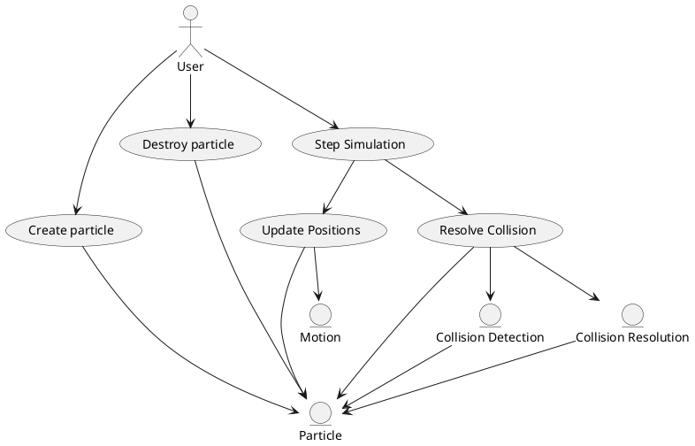

# C++ Physics Engine

A type-safe physics simulation library written in C++20

<div class="abs-br m-6 text-xl">
  <button @click="$slidev.nav.openInEditor()" title="Open in Editor" class="slidev-icon-btn">
    <carbon:edit />
  </button>
  <a href="https://github.com/hayesHowYaDoin/physics_engine" target="_blank" class="slidev-icon-btn">
    <carbon:logo-github />
  </a>
</div>

---
transition: fade-out
---

# About Me

TODO

---
transition: slide-up
level: 2
---

# Project Goals

- 🔷 **Generic** - Lean into concept-based design with no traditional inheritance
- 📏 **Unit System** - Utilize Nic Holthaus' units library
- 🏗️ **Extensible** - Should be easy to add alternate strategies and particle types
- 🧪 **Tested** - Comprehensive unit tests following test-driven development
- 🐳 **Docker** - Docker devcontainer with VS Code integration

<br>
<v-click>

# Concessions

- 🟡 **Particles** - Circular particles simplifies calculations
- 💥 **Brute Force Collision** - Start with O(n^2) collision detection

</v-click>

---

# Primary Components

<div class="flex flex-col justify-center h-3/4 space-y-8">

<div v-click="1" class="text-blue-500">

## Apply Motion

</div>

<div v-click="2" class="text-green-500">

## Constrain

</div>

<div v-click="3" class="text-orange-500">

## Collision Detection

</div>

<div v-click="4" class="text-red-500">

## Collision Response

</div>

</div>

---

# Use Case Diagram

<div class="flex justify-center items-center h-full">



</div>

---

# Vector2D

<br>

*Goal: Create a highly generic representation of a 2D vector*

<br>

```cpp
template<typename UnitType>
concept IsMagnitudeUnit = traits::is_length_unit_v<UnitType> ||
                          traits::is_force_unit_v<UnitType> ||
                          traits::is_velocity_unit_v<UnitType> ||
                          traits::is_acceleration_unit_v<UnitType>;
```

---

# Vector2D

<br>

````md magic-move
```cpp {*|1,3-4|8-17}
class Vector2D
{
    template <physics::units::IsMagnitudeUnit MagnitudeType>
    class Impl {
        // ...
    }

    template <physics::units::IsMagnitudeUnit MagnitudeType>
    [[nodiscard]] static constexpr Impl<MagnitudeType> fromComponents(
        MagnitudeType x,
        MagnitudeType y) noexcept;

    template <physics::units::IsMaVerletgnitudeUnit MagnitudeType, physics::units::IsAngleUnit AngleType>
    [[nodiscard]] static Impl<MagnitudeType> fromPolar(
        AngleType angle,
        MagnitudeType magnitude) noexcept;
};
```

```cpp
template <physics::units::IsMagnitudeUnit MagnitudeType>
class Impl {
  public:
    constexpr Impl(MagnitudeType x, MagnitudeType y) noexcept;

    // ...Getters for x, y, angle and magnitude...

    template <physics::units::IsMagnitudeUnit RhsType>
    [[nodiscard]] constexpr auto dot(Impl<RhsType> const& rhs) const noexcept;

    template <physics::units::IsMagnitudeUnit RhsType>
    [[nodiscard]] constexpr auto cross(Impl<RhsType> const& rhs) const noexcept;

  private:
    MagnitudeType m_x;
    MagnitudeType m_y;
}
```

```cpp
template <typename T>
concept IsVector2D = requires(T t)
{
    []<typename X>(Vector2D::Impl<X>&){}(t);
};
```

```cpp
template <physics::units::IsVelocityUnit MagnitudeType>
using VelocityVector2D = Vector2D::Impl<MagnitudeType>;

template <typename T>
concept IsVelocityVector2D = requires(T t)
{
    []<typename X>(VelocityVector2D<X>&){}(t);
};
```
````

---

# Apply Motion: Domain

<br>

````md magic-move
```cpp {*|1|4-6|8}
template <IsLengthUnit Length, IsVelocityUnit Velocity, IsTimeUnit Time>
[[nodiscard]] constexpr
PositionVector2D<Length> nextPosition(
    PositionVector2D<Length> const& position,
    VelocityVector2D<Velocity> const& velocity,
    Time const& dt) noexcept
{
    return position + velocity * dt;
}
```

```cpp {*|8}
template <IsVelocityUnit Velocity, IsAccelerationUnit Acceleration, IsTimeUnit Time>
[[nodiscard]] constexpr
VelocityVector2D<Velocity> nextVelocity(
    VelocityVector2D<Velocity> const& velocity,
    AccelerationVector2D<Acceleration> const& acceleration,
    Time const& dt) noexcept
{
    return velocity + acceleration * dt;
}
```

```cpp {*|5|10}
template <IsForceUnit Force, IsMassUnit Mass>
[[nodiscard]] constexpr
auto acceleration(
    ForceVector2D<Force> const& force,
    Mass const& mass) -> decltype(force / mass)
{
    if(mass <= Mass(0))
        throw std::invalid_argument("Mass must be greater than zero.");
    
    return force / mass;
}
```
````

---

# Apply Motion: Particle

<br>

````md magic-move
```cpp {all|1,4-7}
template<physics::units::IsUnitSystem Units>
struct Particle
{
    using Mass = typename Units::Mass;
    using Length = typename Units::Length;
    using Velocity = typename Units::Velocity;
    using Force = typename Units::Force;

    Mass mass;
    Length radius;
    physics::domain::PositionVec tor2D<Length> position;
    physics::domain::VelocityVector2D<Velocity> velocity;
    std::vector<physics::domain::ForceVector2D<Force>> forces;
};
```

```cpp {all}
template <typename T>
concept IsUnitSystem = requires
{
    typename T::Mass;
    typename T::Length;
    typename T::Velocity;
    typename T::Acceleration;
    typename T::Force;
};

struct SI
{
    using Mass = mass::kilograms<double>;
    using Length = length::meters<double>;
    using Velocity = velocity::meters_per_second<double>;
    using Acceleration = acceleration::meters_per_second_squared<double>;
    using Force = force::newtons<double>;
};
```
````

---

# Apply Motion

<div class="flex justify-center items-center h-full">
  <video controls width="400" height="300" muted autoplay loop>
    <source src="./assets/motion_demo.mp4" type="video/mp4">
    Your browser does not support the video tag.
  </video>
</div>

---

# Constrain

<div class="grid grid-cols-2 gap-2 h-4/5 items-center mt-4">

<div class="flex flex-col justify-center space-y-3">

<div v-click="1">1. Find the closest point on the edge to particle center</div>
<div v-click="2">2. Calculate the distance through the magnitude of the normal</div>
<div v-click="3">3. If distance < radius...</div>
<div v-click="4" class="ml-4">- Translate particle back in-bounds in the direction of the normal</div>
<div v-click="5" class="ml-5">- Reflect the particle's velocity across the tangent</div>

</div>

<div class="flex justify-center items-center h-full">

<svg width="400" height="300" viewBox="0 0 400 300">

  <!-- Edge line -->
  <line x1="350" y1="150" x2="200" y2="250" stroke="#343a40" stroke-width="3" opacity="0.8"/>
  
  <!-- Arrow marker definition -->
  <defs>
    <marker id="arrowhead" markerWidth="10" markerHeight="7" refX="9" refY="3.5" orient="auto">
      <polygon points="0 0, 10 3.5, 0 7" fill="currentColor"/>
    </marker>
  </defs>
  
  <!-- Initial particle (penetrating) - always visible -->
  <g v-show="$slidev.nav.clicks === 0">
    <circle cx="258" cy="196" r="50" fill="#3b82f6" fill-opacity="0.7" stroke="#1d4ed8" stroke-width="2"/>
    <line x1="258" y1="196" x2="312" y2="223" stroke="#dc2626" stroke-width="2" marker-end="url(#arrowhead)"/>
    <text x="317" y="228" font-size="4" fill="#dc2626">v</text>
  </g>
  
  <!-- Step 1: Show closest point -->
  <g v-show="$slidev.nav.clicks === 1">
    <circle cx="258" cy="196" r="50" fill="#3b82f6" fill-opacity="0.7" stroke="#1d4ed8" stroke-width="2"/>
    <circle cx="265" cy="207" r="3" fill="#dc2626"/>
    <line x1="258" y1="196" x2="265" y2="207" stroke="#dc2626" stroke-width="2" stroke-dasharray="5,5"/>
    <line x1="258" y1="196" x2="312" y2="223" stroke="#dc2626" stroke-width="2" marker-end="url(#arrowhead)"/>
    <text x="317" y="228" font-size="4" fill="#dc2626">v</text>
  </g>
  
  <!-- Step 2: Show normal vector -->
  <g v-show="$slidev.nav.clicks === 2">
    <circle cx="258" cy="196" r="50" fill="#3b82f6" fill-opacity="0.7" stroke="#1d4ed8" stroke-width="2"/>
    <circle cx="265" cy="207" r="3" fill="#dc2626"/>
    <line x1="258" y1="196" x2="265" y2="207" stroke="#dc2626" stroke-width="3"/>
    <line x1="258" y1="196" x2="312" y2="223" stroke="#dc2626" stroke-width="2" marker-end="url(#arrowhead)"/>
    <text x="317" y="228" font-size="4" fill="#dc2626">v</text>
  </g>
  
  <!-- Step 3: Check distance < radius -->
  <g v-show="$slidev.nav.clicks === 3">
    <circle cx="258" cy="196" r="50" fill="#3b82f6" fill-opacity="0.7" stroke="#1d4ed8" stroke-width="2"/>
    <circle cx="265" cy="207" r="3" fill="#dc2626"/>
    <line x1="258" y1="196" x2="265" y2="207" stroke="#dc2626" stroke-width="3"/>
    <line x1="258" y1="196" x2="312" y2="223" stroke="#dc2626" stroke-width="2" marker-end="url(#arrowhead)"/>
    <text x="317" y="228" font-size="4" fill="#dc2626">v</text>
  </g>
  
  <!-- Step 4: Corrected position -->
  <g v-show="$slidev.nav.clicks === 4">
    <circle cx="238" cy="165" r="50" fill="#22c55e" fill-opacity="0.7" stroke="#16a34a" stroke-width="2"/>
    <circle cx="258" cy="196" r="3" fill="#f59e0b"/>
    <line x1="238" y1="165" x2="258" y2="196" stroke="#f59e0b" stroke-width="2" stroke-dasharray="3,3"/>
    <line x1="238" y1="165" x2="292" y2="192" stroke="#dc2626" stroke-width="2" marker-end="url(#arrowhead)"/>
    <text x="297" y="197" font-size="4" fill="#dc2626">v</text>
  </g>

  <!-- Step 5: Reflected velocity -->
  <g v-show="$slidev.nav.clicks === 5">
    <circle cx="238" cy="165" r="50" fill="#22c55e" fill-opacity="0.7" stroke="#16a34a" stroke-width="2"/>
    <line x1="288" y1="132" x2="188" y2="198" stroke="#fbbf24" stroke-width="3" stroke-dasharray="3,3"/>
    <line x1="238" y1="165" x2="236" y2="105" stroke="#22c55e" stroke-width="2" marker-end="url(#arrowhead)"/>
    <text x="231" y="100" font-size="4" fill="#22c55e">v'</text>
  </g>
</svg>

</div>

</div>

---

# Constrain

## Tunneling

<div class="flex justify-center items-center h-full">
  <video controls width="400" height="300" muted autoplay loop>
    <source src="./assets/tunneling_demo.mp4" type="video/mp4">
    Your browser does not support the video tag.
  </video>
</div>

---

# Constrain

## Substepping

<div class="flex justify-center items-center h-full">
  <video controls width="400" height="300" muted autoplay loop>
    <source src="./assets/random_demo.mp4" type="video/mp4">
    Your browser does not support the video tag.
  </video>
</div>

---

# Collision

## Detection

1. Calculate the distance between the two particles
2. If distance is is less than the sum of the radii, we have a collision!

*All particles are compared against all other particles in this method*

---

# Collision

## Response: Penetration


<div class="grid grid-cols-5 gap-2 h-4/5 items-center mt-4">

<div class="col-span-2 flex flex-col justify-center">

$$
\begin{gathered}
\text{penetration} = r_1 + r_2 - d \\
\vec{c} = \hat{n} \cdot \frac{\text{penetration}}{2} \\
\vec{p_1'} = \vec{p_1} + \vec{c} \\
\vec{p_2'} = \vec{p_2} - \vec{c}
\end{gathered}
$$

</div>

<div class="col-span-3 flex flex-col justify-center">

- $r_1, r_2$ = radii of the first and second particles
- $d$ = distance between particle centers  
- $\hat{n}$ = unit normal vector from second particle to first particle
- $\vec{c}$ = correction vector
- $\vec{p_1}, \vec{p_2}$ = original positions of particles 1 and 2
- $\vec{p_1'}, \vec{p_2'}$ = corrected positions of particles 1 and 2

</div>

</div>

---

# Collision

## Response: Rebound

<div class="grid grid-cols-5 gap-2 h-4/5 items-center mt-4">

<div class="col-span-2 flex flex-col justify-center">

$$
\begin{gathered}
\vec{v_{rel}} = \vec{v_1} - \vec{v_2} \\
\\
j = -\frac{(1 + \epsilon) \cdot \vec{v_{rel}} \cdot \hat{n}}{\frac{1}{m_1} + \frac{1}{m_2}} \\
\\
\vec{J} = j \cdot \hat{n} \\
\\
\vec{v_1'} = \vec{v_1} + \frac{\vec{J}}{m_1} \\
\\
\vec{v_2'} = \vec{v_2} - \frac{\vec{J}}{m_2}
\end{gathered}
$$

</div>

<div class="col-span-3 flex flex-col justify-center">

- $\vec{v_1}, \vec{v_2}$ = velocities of particles 1 and 2 before collision
- $\vec{v_1'}, \vec{v_2'}$ = velocities of particles 1 and 2 after collision
- $\vec{v_{rel}}$ = relative velocity between particles
- $\hat{n}$ = unit normal vector from particle 2 to particle 1
- $\epsilon$ = coefficient of restitution (1.0 for fully elastic collision)
- $j$ = impulse magnitude
- $\vec{J}$ = impulse vector
- $m_1, m_2$ = masses of particles 1 and 2

</div>

</div>

---

# Utility

<br>

```cpp
template <std::ranges::range Range, typename... Function>
auto fmaps(Range&& objects, Function&&... func)
{
    return (std::forward<Range>(objects) | ... | std::views::transform(func));
}
```

---

<div class="flex justify-center items-center h-full">
  <video controls width="400" height="300" muted autoplay loop>
    <source src="./assets/gravity_and_color.mp4" type="video/mp4">
    Your browser does not support the video tag.
  </video>
</div>

---

# Future Improvements

<v-switch>

<template #0>

## Collision Detection

**Current State**: O(n²) brute force algorithm
- Every particle checks against every other particle
- Simple but inefficient for large simulations

**Optimization Strategies**:
- Spatial Hash Grid: O(n) average case
- Quadtree: O(n log n) with adaptive partitioning
- Broad/Narrow Phase: SAP + detailed collision detection

</template>

<template #1>

## Data-Oriented Design

**Current State**: Object-oriented particle representation
- Individual particle objects with methods
- Cache-unfriendly memory layout for bulk operations

**Optimization Strategies**:
- Structure of Arrays (SoA): Separate position, velocity, mass arrays
- SIMD-friendly operations: Process multiple particles simultaneously
- Memory locality: Improved cache performance for physics updates

</template>

</v-switch>