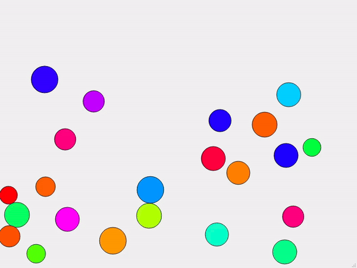
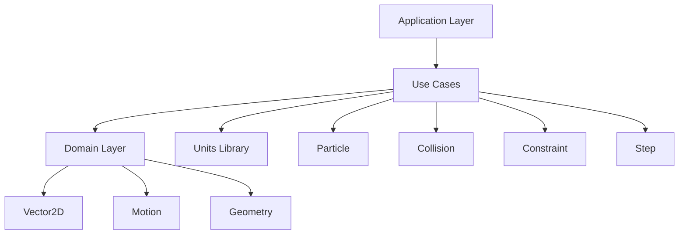
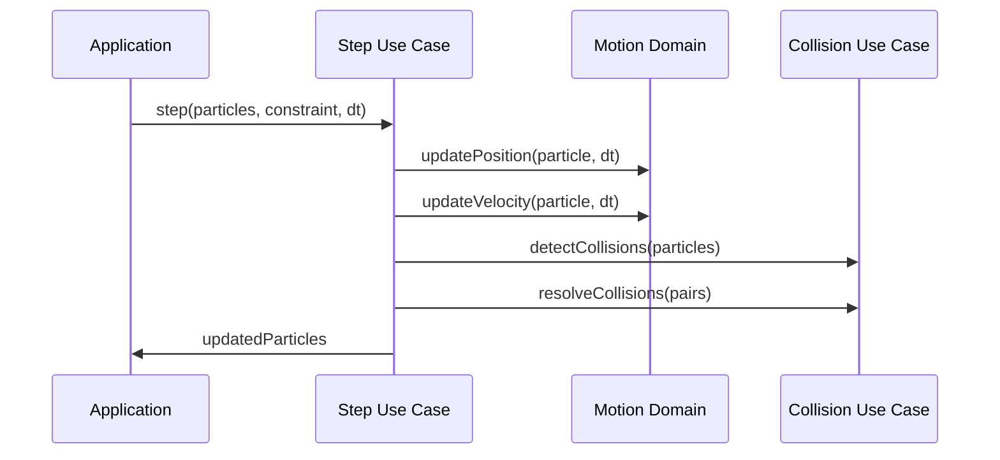

---
# try also 'default' to start simple
theme: seriph
# random image from a curated Unsplash collection by Anthony
# like them? see https://unsplash.com/collections/94734566/slidev
background: https://cover.sli.dev
# some information about your slides (markdown enabled)
title: C++ Physics Engine
info: |
  ## C++ Physics Engine Presentation
  A modern physics simulation library with compile-time safety.

  Built with C++20 and type-safe units.
# apply UnoCSS classes to the current slide
class: text-center
# https://sli.dev/features/drawing
drawings:
  persist: false
# slide transition: https://sli.dev/guide/animations.html#slide-transitions
transition: slide-left
# enable MDC Syntax: https://sli.dev/features/mdc
mdc: true
---

# C++ Physics Engine

A modern 2D physics simulation library

<div class="mt-8">
  
</div>

<div @click="$slidev.nav.next" class="mt-8 py-1" hover:bg="white op-10">
  Press Space for next page <carbon:arrow-right />
</div>

<div class="abs-br m-6 text-xl">
  <button @click="$slidev.nav.openInEditor()" title="Open in Editor" class="slidev-icon-btn">
    <carbon:edit />
  </button>
  <a href="https://github.com/hayesHowYaDoin/physics_engine" target="_blank" class="slidev-icon-btn">
    <carbon:logo-github />
  </a>
</div>

<!--
This presentation showcases a C++20 physics engine library designed for educational purposes and real-world applications.
-->

---
transition: fade-out
---

# Project Overview

A modern C++ physics engine designed for learning and real-world applications

- ⚡ **High Performance** - Built with C++20 features and compile-time optimizations
- 🔒 **Type Safety** - Uses Nic Holthaus' units library for dimensional analysis
- 🎯 **Simple API** - Clean, functional design inspired by the Boost project
- 🏗️ **Modular** - Well-structured codebase with clear separation of concerns
- 🧪 **Tested** - Comprehensive test suite ensuring reliability
- 🐳 **Dev-Ready** - Docker development environment with VS Code integration
- 📐 **Generic** - Template-based design supporting different unit systems

<br>

*Currently supports circular particle collision detection and response*

<!--
The physics engine focuses on educational value while maintaining production-quality code standards.
-->

---
transition: slide-up
level: 2
---

# Key Features

## Type-Safe Units System

Built on top of Nic Holthaus' C++ units library for compile-time dimensional analysis

```cpp
using physics::units::literals;

// Compile-time unit safety
auto position = physics::domain::Vector2D::fromComponents(0.0_m, 0.0_m);
auto velocity = physics::domain::Vector2D::fromComponents(1.0_mps, -1.0_mps);
auto force = physics::domain::Vector2D::fromComponents(0.0_N, -9.81_N);
```

<v-click>

## Constexpr Everything

Vector operations and unit conversions are completely evaluable at compile time

</v-click>

---
layout: two-cols
layoutClass: gap-16
---

# Architecture

The codebase follows clean architecture principles with clear separation:

**Domain Layer**
- `Vector2D` - 2D vector mathematics
- `Motion` - Physics equations
- `Geometry` - Geometric primitives

**Use Cases Layer**
- `Particle` - Particle representation
- `Collision` - Collision detection/response
- `Constraint` - Boundary enforcement
- `Step` - Simulation stepping

::right::

```cpp
// Example particle creation
physics::usecases::Particle<physics::units::SI> particle {
  .mass {1.0_kg},
  .radius {1.0_m},
  .position {Vector2D::fromComponents(0.0_m, 0.0_m)},
  .velocity {Vector2D::fromComponents(1.0_mps, -1.0_mps)},
  .forces {Vector2D::fromComponents(0.0_N, -9.81_N)},
  .metadata {customData}
};
```

---
layout: image-right
image: ../resource/collision.gif
---

# Vector Mathematics

Compile-time 2D vector operations with operator overloading

```cpp
// Vector creation from components
auto v1 = Vector2D::fromComponents(3.0_m, 4.0_m);
auto v2 = Vector2D::fromComponents(1.0_m, 2.0_m);

// Standard operations
auto sum = v1 + v2;          // Addition
auto diff = v1 - v2;         // Subtraction
auto scaled = v1 * 2.0;      // Scalar multiplication

// Vector products
auto dotProduct = v1.dot(v2);    // Dot product
auto crossProduct = v1.cross(v2); // Cross product

// All operations are constexpr!
static_assert(v1.magnitude() > 0.0_m);
```

<!--
The vector system provides a solid foundation for all physics calculations with compile-time guarantees.
-->

---
level: 2
---

# Particle System

Particles are simple structs with constrained unit types and metadata support

````md magic-move {lines: true}
```cpp {*|2-3|4-5|6-7|8}
// Complete particle definition
physics::usecases::Particle<physics::units::SI> particle {
  .mass {1.0_kg},                    // Mass in kilograms
  .radius {1.0_m},                   // Radius in meters
  .position {Vector2D::fromComponents(0.0_m, 0.0_m)},  // Position vector
  .velocity {Vector2D::fromComponents(1.0_mps, -1.0_mps)}, // Velocity
  .forces {Vector2D::fromComponents(0.0_N, -9.81_N)},   // Applied forces
  .metadata {customUserData}         // Any additional data
};
```

```cpp {*|1-4|5-8}
// Constraint definition (boundary)
physics::usecases::Polygon2D<Length> constraint {{
  PositionVector2D(0.0_m, 0.0_m),   // Bottom-left
  PositionVector2D(10.0_m, 0.0_m),  // Bottom-right
  PositionVector2D(10.0_m, 10.0_m), // Top-right
  PositionVector2D(0.0_m, 10.0_m)   // Top-left
}};
```

```cpp {*|3|4}
// Simulation stepping
auto frameRate = 33_ms;
auto updatedParticles = physics::usecases::step(
  particles, constraint, frameRate, subSteps
);
```
````

---

# Collision Detection

<div grid="~ cols-2 gap-4">
<div>

## Current Implementation

- **Circular particles only** - Simple sphere-sphere collision
- **O(n²) complexity** - Each particle checks against every other
- **Elastic collisions** - Conservation of momentum and energy
- **Constraint enforcement** - Particles bounce off boundaries

## Performance Characteristics

```cpp
// Collision check between two particles
bool colliding = distance(p1.position, p2.position) < 
                (p1.radius + p2.radius);
```

</div>
<div>

## Future Optimizations

- **Spatial partitioning** - Quadtree or grid-based
- **Broad phase filtering** - AABB or sphere culling
- **Continuous collision** - Prevent tunneling
- **Different shapes** - Polygons, lines, curves

<div class="mt-4 p-4 bg-orange-100 rounded">

**Note**: Current O(n²) approach works well for educational purposes and small simulations

</div>

</div>
</div>

<!--
The collision system is designed for clarity and educational value, with clear paths for optimization.
-->

---
class: px-20
---

# Development Environment

Modern C++ development setup with containerized workflow

<div grid="~ cols-2 gap-4" m="t-4">

## Technologies Used

- **C++20** - Modern language features
- **CMake 3.26+** - Build system
- **CPM** - Package management
- **Google Test** - Unit testing framework
- **Docker** - Containerized development
- **VS Code** - IDE with dev container support

## Project Structure

```
physics_engine/
├── include/          # Header files
├── test/            # Unit tests
├── libs/units/      # External units library
├── cmake/           # Build configuration
└── resource/        # Assets (collision.gif)
```

</div>

**Getting Started**: Clone repo → Open in VS Code → "Dev Containers: Open Folder In Container"

---

# Design Philosophy

Key principles driving the architecture and implementation

<div v-click>

## Type Safety First

```cpp
// Compile-time dimensional analysis prevents unit errors
auto energy = 0.5 * mass * velocity.magnitude().pow<2>();
//            ^^^ Energy units automatically derived
```

</div>

<v-click>

## <span v-mark.red="3">Functional Design</span>
Functions return new objects rather than modifying existing ones

<span v-mark.circle.orange="4">Generic Programming</span>
Template-based design supports different unit systems

```cpp
template<typename UnitSystem>
struct Particle { /* ... */ };
```

</v-click>

<div mt-8 v-click>

**Goal**: Make physics simulations both educational and production-ready

</div>

---

# Physics Equations

Core physics implemented with compile-time safety and modern C++ features

```cpp
// Newton's second law: F = ma
template<typename UnitSystem>
constexpr auto calculateAcceleration(
    const Force auto& force,
    const Mass auto& mass
) -> Acceleration {
    return force / mass;
}

// Kinematic equations for motion
template<typename UnitSystem>
constexpr auto updatePosition(
    const PositionVector2D& position,
    const VelocityVector2D& velocity,
    const Time auto& deltaTime
) -> PositionVector2D {
    return position + velocity * deltaTime;
}
```

<div class="mt-8 p-4 bg-blue-100 rounded">

**Key Insight**: All physics calculations are `constexpr` - they can be evaluated at compile time when given constant inputs!

</div>

<!--
The physics implementation demonstrates how modern C++ can make scientific computing both safe and performant.
-->

---

# Mathematical Foundation

Physics equations implemented with mathematical rigor

<div h-3 />

**Collision Response**: Conservation of momentum in 2D

$$
m_1\vec{v_1} + m_2\vec{v_2} = m_1\vec{v_1'} + m_2\vec{v_2'}
$$

**Elastic Collision**: Coefficient of restitution

$$ {1|2|all}
\begin{aligned}
\vec{v_{1f}} &= \vec{v_{1i}} - \frac{2m_2}{m_1 + m_2}(\vec{v_{1i}} - \vec{v_{2i}}) \\
\vec{v_{2f}} &= \vec{v_{2i}} - \frac{2m_1}{m_1 + m_2}(\vec{v_{2i}} - \vec{v_{1i}})
\end{aligned}
$$

**Kinematic Integration**: Verlet method for numerical stability

$$
\vec{x}_{n+1} = 2\vec{x}_n - \vec{x}_{n-1} + \vec{a}_n \Delta t^2
$$

---

# System Architecture

Clean architecture with clear dependencies and responsibilities

<div class="grid grid-cols-2 gap-8 pt-4">





</div>

**Design Pattern**: Functional composition over object-oriented inheritance

---

# Future Roadmap

Planned enhancements and optimization opportunities

## Performance Optimizations

<div class="grid grid-cols-2 gap-6 mt-4">

<div>

**Spatial Partitioning**
- Quadtree implementation
- Grid-based broad phase
- O(n log n) complexity target

**Collision Improvements**
- Continuous collision detection
- Support for polygonal shapes
- Constraint solving system

</div>

<div>

**API Enhancements**
- Simulation manager class
- Particle lifecycle management
- Performance profiling tools

**Integration Options**
- Python bindings (pybind11)
- WebAssembly export
- Graphics library integration

</div>

</div>

<div class="mt-6 p-4 bg-green-100 rounded">

**Current Status**: Production-ready for educational use and small-scale simulations

</div>

---

# Testing & Quality

Comprehensive testing strategy ensuring reliability and correctness

## Test Coverage

```cpp
// Unit tests for vector operations
TEST(Vector2DTest, MagnitudeCalculation) {
    auto vector = Vector2D::fromComponents(3.0_m, 4.0_m);
    EXPECT_NEAR(vector.magnitude().value(), 5.0, PRECISION);
}

// Integration tests for collision detection
TEST(CollisionTest, ElasticCollisionConservation) {
    // Setup two particles
    auto [p1, p2] = createTestParticles();
    auto initialMomentum = calculateTotalMomentum({p1, p2});
    
    // Perform collision
    auto [p1_after, p2_after] = resolveCollision(p1, p2);
    auto finalMomentum = calculateTotalMomentum({p1_after, p2_after});
    
    // Verify conservation
    EXPECT_VECTOR_NEAR(initialMomentum, finalMomentum, PRECISION);
}
```

**Testing Framework**: Google Test with custom physics-specific matchers

---
layout: center
class: text-center
---

# Thank You!

A modern C++ physics engine for education and beyond

<div class="mt-8">
  
</div>

**GitHub**: [github.com/hayesHowYaDoin/physics_engine](https://github.com/hayesHowYaDoin/physics_engine)

**Key Takeaways**: Type safety • Modern C++ • Educational focus • Production quality

<div class="mt-8 text-sm opacity-75">
Built with C++20 • CMake • Docker • Nic Holthaus Units Library
</div>
